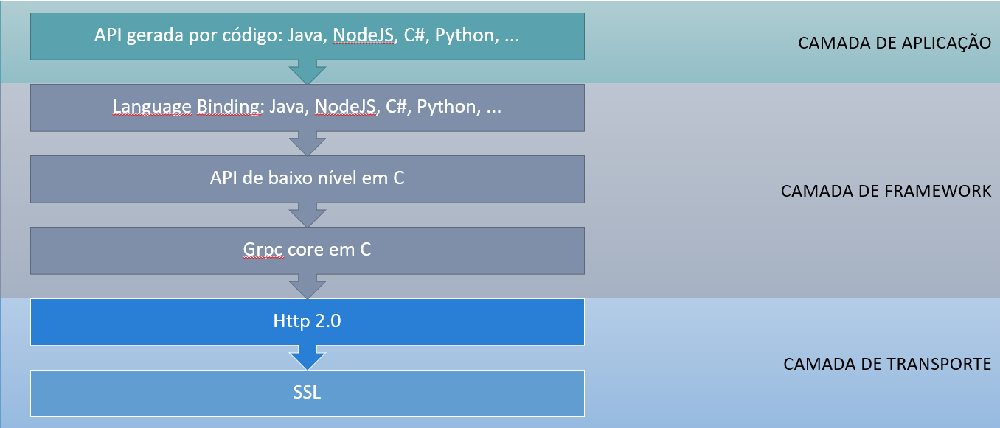
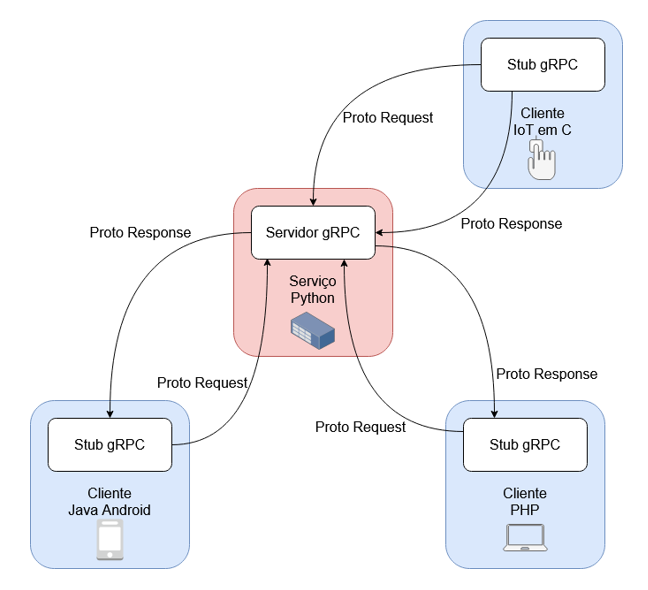

# Roteiro de Trabalho: Introdução a gRPC

gRPC é um framework RPC (*Remote Procedure Call*) desenvolvido pela Google que utiliza HTTP/2 para transporte e Protocol Buffers como formato de serialização de dados.

Open-source: [http://grpc.io](http://grpc.io)

## Índice

1. [Principais características](#principais-características)
2. [Desenvolvimento de uma aplicação gRPC](#desenvolvimento-de-uma-aplicação-grpc)
3. [Protocol Buffers](#protocol-buffers)
4. [Integração de um cliente Flutter e um servidor Python](#integração-de-um-cliente-flutter-e-um-servidor-python)
5. [Executando a aplicação](#executando-a-aplicação)
6. [Observações Finais](#observações-finais)

## Principais características

- Independente de linguagem (suporte a 10+ linguagens)
- Alta performance e baixa latência (através de serialização de objetos)
- Suporte a streaming bidirecional
- Geração automática de código cliente/servidor
- Autenticação integrada via SSL/TLS
- Robusto: timeouts, balanceamento de carga, etc.

## Desenvolvimento de uma aplicação gRPC

Neste roteiro, vamos desenvolver uma aplicação  gRPC em Python.

### Pré-requisitos

1. Python 3.7+ instalado
2. Pip atualizado
3. Ambiente virtual (opcional, mas recomendado)

### Instalação das ferramentas

```bash
# Atualize o pip
python -m pip install --upgrade pip

# Instale as dependências principais
pip install grpcio grpcio-tools

# Verifique as versões instaladas
python -m pip show grpcio grpcio-tools protobuf
```

**Versões atuais (2025):**

- Name: grpcio
  - Version: 1.71.0
- Name: grpcio-tools
  - Version: 1.71.0
- Name: protobuf
  - Version: 5.29.4

### Arquitetura do gRPC



O gRPC é baseado em uma arquitetura cliente-servidor onde:

1. **Cliente**: Inicia a comunicação enviando requisições para o servidor
2. **Servidor**: Processa as requisições e retorna as respostas
3. **Stub/Skeleton**: Código gerado automaticamente que facilita a comunicação entre cliente e servidor
4. **Protocol Buffers**: Usado para serializar/desserializar dados de forma eficiente



Os **tipos de comunicação** suportados incluem:

- **Unary RPC**: Uma única requisição, uma única resposta (como REST)
- **Server Streaming RPC**: Uma requisição, múltiplas respostas
- **Client Streaming RPC**: Múltiplas requisições, uma resposta
- **Bidirectional Streaming RPC**: Fluxo bidirecional de requisições e respostas

### Protocol Buffers

Protocol Buffers (ou Protobuf) é um formato de serialização de dados desenvolvido pela Google. Ele é usado para definir a estrutura dos dados que serão trocados entre o cliente e o servidor.

- **IDL (Interface Definition Language)**: Define como as estruturas de dados serão trocadas entre sistemas
- **Interoperabilidade entre sistemas**: Protobuf permite que diferentes sistemas, escritos em linguagens distintas, troquem dados de forma eficiente e consistente
- **Modelo de dados estruturado**: Especifica o formato das mensagens de requisição e resposta
- **Formato eficiente para transmissão**: Serialização binária compacta, reduzindo o volume de dados na rede
- **Geração automática de código**: Compilação do arquivo .proto para gerar os "stubs" necessários para comunicação
- **Manutenção e evolução de APIs**: Com suporte a versões e campos opcionais, Protobuf facilita a evolução de APIs sem quebrar compatibilidade com versões anteriores

#### Quando o Protocol Buffers não é uma boa escolha

- **Leitura humana**: Por ser um formato binário, Protobuf não é legível por humanos como JSON ou XML
- **Memória**: Protobuf supõe que mensagens inteiras podem ser carregadas em memória de uma só vez
- **compatibilidade binária**: Quando protobufs são serializados, os mesmos dados podem ter diferentes serializações binárias. Não é possível comparar duas mensagens para igualdade sem fazer o parsing completo da mensagem
- **Suporte a linguagens**: Os buffers de protocolo não são bem suportados em linguagens não orientadas a objetos

#### Como o Protocol Buffers funciona

1. **Definição do esquema**: O desenvolvedor cria um arquivo `.proto` que define as mensagens e serviços
2. **Compilação do esquema**: O arquivo `.proto` é compilado usando o `protoc` (*Protocol Buffers Compiler*), gerando código para a linguagem de programação desejada
3. **Serialização e desserialização**: O código gerado é usado para converter objetos em formato binário (serialização) e vice-versa (desserialização), permitindo a troca de dados entre sistemas

#### O que é uma mensagem?

Uma mensagem em Protobuf é uma estrutura de dados que define os campos que serão transmitidos. Cada campo possui:

- **Nome**: Identifica o campo.
- **Tipo**: Define o tipo de dado (e.g., `string`, `int32`, `bool`).
- **Número**: Um identificador único usado na serialização binária.

Exemplo de mensagem:

```proto
message HelloRequest {
  string name = 1;  // Campo obrigatório
  optional int32 age = 2;  // Campo opcional
}
```

#### O que é um serviço?

Um serviço em Protobuf define as operações (ou métodos) que podem ser chamadas remotamente. Cada operação é uma chamada RPC do tipo  **request** ou **reply**.

Exemplo de serviço:

```proto
service Greeter {
  rpc SayHello (HelloRequest) returns (HelloReply);
}
```

### Passo 1: Definindo o arquivo .proto

Crie um arquivo chamado `helloworld.proto` com o seguinte conteúdo:

```proto
syntax = "proto3";

package helloworld;

// Opções para geração de código (opcional)
option java_package = "com.example.helloworld";
option java_multiple_files = true;
option go_package = "github.com/example/helloworld";

// Definição do serviço
service Greeter {
  // Chamada RPC simples
  rpc SayHello (HelloRequest) returns (HelloReply) {}
  
  // Chamada com streaming de resposta
  rpc LotsOfReplies (HelloRequest) returns (stream HelloReply) {}
  
  // Chamada com streaming de requisição
  rpc LotsOfGreetings (stream HelloRequest) returns (HelloReply) {}
  
  // Chamada com streaming bidirecional
  rpc BidiHello (stream HelloRequest) returns (stream HelloReply) {}
}

// Mensagem de requisição
message HelloRequest {
  string name = 1;
  optional int32 age = 2;  // Campo opcional (novo em proto3)
}

// Mensagem de resposta
message HelloReply {
  string message = 1;
  repeated string tags = 2;  // Campo repetido (lista)
}
```

### Passo 2: Gerando os stubs

Execute o compilador de Protocol Buffers para gerar os códigos Python:

```bash
python -m grpc_tools.protoc -I. --python_out=. --grpc_python_out=. helloworld.proto
```

Isso irá gerar dois arquivos:

- `helloworld_pb2.py`: Contém as classes das mensagens
- `helloworld_pb2_grpc.py`: Contém as classes do servidor e cliente

### Passo 3: Implementando o servidor

Crie um arquivo `server.py`:

```python
from concurrent import futures
import logging
import grpc
import helloworld_pb2
import helloworld_pb2_grpc

class Greeter(helloworld_pb2_grpc.GreeterServicer):
    def SayHello(self, request, context):
        return helloworld_pb2.HelloReply(
            message=f"Hello, {request.name}!",
            tags=["welcome", "new_user"]
        )
    
    def LotsOfReplies(self, request, context):
        for i in range(5):
            yield helloworld_pb2.HelloReply(
                message=f"Hello {request.name} (response {i+1})"
            )
    
    def LotsOfGreetings(self, request_iterator, context):
        names = []
        for request in request_iterator:
            names.append(request.name)
        return helloworld_pb2.HelloReply(
            message=f"Hello to all: {', '.join(names)}"
        )
    
    def BidiHello(self, request_iterator, context):
        for request in request_iterator:
            yield helloworld_pb2.HelloReply(
                message=f"Hello, {request.name}!"
            )

def serve():
    # Cria um servidor com 10 threads de worker
    server = grpc.server(futures.ThreadPoolExecutor(max_workers=10))
    
    # Adiciona o serviço ao servidor
    helloworld_pb2_grpc.add_GreeterServicer_to_server(Greeter(), server)
    
    # Configura a porta (com autenticação SSL opcional)
    server.add_insecure_port('[::]:50051')
    
    # Inicia o servidor
    server.start()
    print("Servidor gRPC rodando na porta 50051...")
    
    # Mantém o servidor ativo
    server.wait_for_termination()

if __name__ == '__main__':
    logging.basicConfig()
    serve()
```

### Passo 4: Implementando o cliente

Crie um arquivo `client.py`:

```python
import logging
import grpc
import helloworld_pb2
import helloworld_pb2_grpc

def run():
    # Configura a conexão com o servidor
    with grpc.insecure_channel('localhost:50051') as channel:
        stub = helloworld_pb2_grpc.GreeterStub(channel)
        
        # Chamada RPC simples
        print("=== Chamada Simples ===")
        response = stub.SayHello(helloworld_pb2.HelloRequest(name="Alice"))
        print(f"Resposta: {response.message}")
        print(f"Tags: {response.tags}")
        
        # Chamada com streaming de resposta
        print("\n=== Streaming de Resposta ===")
        responses = stub.LotsOfReplies(helloworld_pb2.HelloRequest(name="Bob"))
        for response in responses:
            print(f"Resposta: {response.message}")
        
        # Chamada com streaming de requisição
        print("\n=== Streaming de Requisição ===")
        def generate_requests():
            names = ["Carol", "Dave", "Eve"]
            for name in names:
                yield helloworld_pb2.HelloRequest(name=name)
        response = stub.LotsOfGreetings(generate_requests())
        print(f"Resposta combinada: {response.message}")
        
        # Chamada bidirecional
        print("\n=== Streaming Bidirecional ===")
        def generate_bidi_requests():
            names = ["Frank", "Grace", "Heidi"]
            for name in names:
                yield helloworld_pb2.HelloRequest(name=name)
        responses = stub.BidiHello(generate_bidi_requests())
        for response in responses:
            print(f"Resposta: {response.message}")

if __name__ == '__main__':
    logging.basicConfig()
    run()
```

### Passo 5: Executando a aplicação

1. Primeiro, inicie o servidor:

```bash
python server.py
```

2. Em outro terminal, execute o cliente:

```bash
python client.py
```

## Integração de um cliente Flutter e um servidor Python

- **Servidor Python gRPC**: Mantem um catálogo de números de telefone na memória e recebe consultas
- **Cliente Flutter**: Envia consultas de nomes e exibe números de telefone das respostas do servidor

### Definição do Protocol Buffer (phonebook.proto)

```proto
syntax = "proto3";

package phonebook;

service PhonebookService {
  rpc LookupNumber (LookupRequest) returns (LookupResponse);
}

message LookupRequest {
  string name = 1;
}

message LookupResponse {
  string name = 1;
  string phone_number = 2;
  bool found = 3;
}
```

### Geração dos stub Python para o servidor

```bash
python -m grpc_tools.protoc -I. --python_out=. --grpc_python_out=. phonebook.proto
```

### Implementação do server.py

```python
from concurrent import futures
import grpc
import phonebook_pb2
import phonebook_pb2_grpc

class Phonebook:
    def __init__(self):
        self.entries = {
            "Vítor Araujo": "(38) 1683-2824",
            "Márcio Teixeira": "(96) 2554-7858",
            "Thiago Sousa": "(24) 6732-4569",
            "Diego Almeida": "(38) 4423-2776",
            "Júlio do Nascimento": "(21) 1686-3487",
            "Raimundo Machado": "(25) 3947-6578",
            "Felipe Gonçalves": "(47) 1871-7863",
            "Alex Almeida": "(85) 5377-7335",
            "Francisco Batista": "(67) 3236-8885",
            "Matheus Nunes": "(41) 8127-7758",
            "André Borges": "(95) 2854-5188",
            "Antônio dos Santos": "(51) 3934-2538",
            "Marcos Gonçalves": "(56) 2773-7748",
            "Gustavo Dias": "(28) 5223-6669",
            "Luíz Santana": "(78) 9663-3858",
            "Francisco Costa": "(13) 6747-4213",
            "Leandro Lopes": "(45) 3328-7387",
            "Guilherme Lima": "(33) 4912-6854",
            "Ânderson Almeida": "(17) 4949-7835",
            "José da Silva": "(95) 4475-8123",
            "Carlos Oliveira": "(21) 7527-4445",
            "Diego Ferreira": "(27) 9945-2542",
            "Ricardo de Lima": "(34) 5442-1662",
            "Vítor Mendes": "(61) 5187-8881",
            "Mateus da Silva": "(62) 8717-8224",
            "Luciano de Oliveira": "(66) 8582-3838",
            "Alexandre Sousa": "(33) 4573-6432",
            "Renato Pereira": "(41) 6238-6323",
            "Sérgio da Costa": "(22) 4443-1635",
            "André Gonçalves": "(37) 9235-5162",
            "Bruno Nunes": "(47) 7669-4235",
            "Roberto Santos": "(45) 3569-7744"
        }

class PhonebookService(phonebook_pb2_grpc.PhonebookServiceServicer):
    def __init__(self):
        self.phonebook = Phonebook()

    def LookupNumber(self, request, context):
        name = request.name
        phone_number = self.phonebook.entries.get(name, "")
        return phonebook_pb2.LookupResponse(
            name=name,
            phone_number=phone_number,
            found=phone_number != ""
        )

def serve():
    server = grpc.server(futures.ThreadPoolExecutor(max_workers=10))
    phonebook_pb2_grpc.add_PhonebookServiceServicer_to_server(
        PhonebookService(), server)
    server.add_insecure_port('[::]:50051')
    server.start()
    print("Catálo de telefone rodando na porta 50051...")
    server.wait_for_termination()

if __name__ == '__main__':
    serve()
```

### Implementação do cliente Flutter

#### Adicionar dependências ao pubspec.yaml

```yaml
dependencies:
  flutter:
    sdk: flutter
  grpc: ^3.1.0
  protobuf: ^2.1.0
  fixnum: ^1.1.0
```

#### Gerar código Dart a partir do arquivo .proto

1. Instalar compilador protoc: <https://grpc.io/docs/protoc-installation/>
2. Instalar plugin Dart: `dart pub global activate protoc_plugin`
3. Gerar código Dart:

```bash
protoc --dart_out=grpc:lib/ -I. phonebook.proto
```

#### Implementar o cliente Flutter

#### main.dart

```dart
import 'package:flutter/material.dart';
import 'package:grpc/grpc.dart';
import 'phonebook.pb.dart';
import 'phonebook.pbgrpc.dart';

void main() {
  runApp(PhonebookApp());
}

class PhonebookApp extends StatelessWidget {
  @override
  Widget build(BuildContext context) {
    return MaterialApp(
      title: 'Catalog de Telefone',
      theme: ThemeData(primarySwatch: Colors.pink),
      home: PhonebookScreen(),
    );
  }
}

class PhonebookScreen extends StatefulWidget {
  @override
  _PhonebookScreenState createState() => _PhonebookScreenState();
}

class _PhonebookScreenState extends State<PhonebookScreen> {
  final TextEditingController _nameController = TextEditingController();
  String _responseText = '';
  bool _isLoading = false;

  Future<void> _lookupNumber() async {
    setState(() {
      _isLoading = true;
      _responseText = '';
    });

    try {
      final channel = ClientChannel(
        'localhost',
        port: 50051,
        options: ChannelOptions(
          credentials: ChannelCredentials.insecure(),
          codecRegistry: CodecRegistry(codecs: const [GzipCodec(), IdentityCodec()]),
        ),
      );

      final stub = PhonebookServiceClient(channel);
      final response = await stub.lookupNumber(
        LookupRequest()..name = _nameController.text,
        options: CallOptions(timeout: Duration(seconds: 5)),
      );

      setState(() {
        _responseText = response.found
            ? '${response.name}: ${response.phoneNumber}'
            : '${response.name} não cadastrado';
      });
    } catch (e) {
      setState(() {
        _responseText = 'Erro: ${e.toString()}';
      });
    } finally {
      setState(() {
        _isLoading = false;
      });
    }
  }

  @override
  Widget build(BuildContext context) {
    return Scaffold(
      appBar: AppBar(title: Text('Catálogo de Telefone')),
      body: Padding(
        padding: const EdgeInsets.all(16.0),
        child: Column(
          children: [
            TextField(
              controller: _nameController,
              decoration: InputDecoration(
                labelText: 'Nome',
                hintText: 'Digite um nome para buscar',
              ),
            ),
            SizedBox(height: 20),
            ElevatedButton(
              onPressed: _isLoading ? null : _lookupNumber,
              child: _isLoading
                  ? CircularProgressIndicator()
                  : Text('Buscar Número'),
            ),
            SizedBox(height: 20),
            Text(
              _responseText,
              style: TextStyle(fontSize: 18),
            ),
          ],
        ),
      ),
    );
  }

  @override
  void dispose() {
    _nameController.dispose();
    super.dispose();
  }
}
```

## Executando a aplicação

1. **Inicie o servidor Python**:

```bash
python server.py
```

2. **Execute o aplicativo Flutter**:

```bash
flutter run
```

## Observações Finais

- Para executar o cliente Flutter em um dispositivo físico ou em um emulador, certifique-se de que o servidor Python esteja acessível na rede local
- Substitua 'localhost' pelo endereço IP do servidor no cliente Flutter
- Adicione a permissão de internet ao AndroidManifest.xml para Android:

  ```xml
  <uses-permission android:name="android.permission.INTERNET" />
  ```
