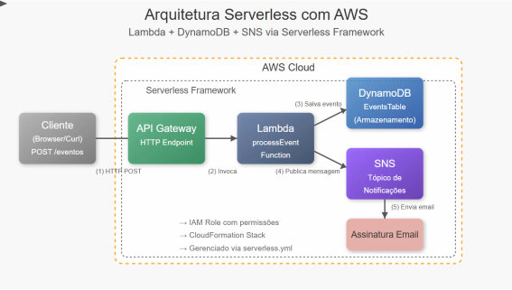

# **Laboratório AWS Lambda, DynamoDB e SNS**

## **Objetivo**

Criar um sistema de notificação de eventos utilizando serviços serverless da AWS: Lambda, DynamoDB e SNS, conforme desenho arquitetural abaixo.



## **Pré-requisitos**

* Conta AWS (acadêmica ou sandbox)  
* Navegador web atualizado  
* Conhecimentos básicos de JavaScript

---

## **PARTE 1: Configuração do DynamoDB**

### **Passo 1: Acessar o Console do DynamoDB**

1. Faça login no Console AWS  
2. Na barra de pesquisa superior, digite "DynamoDB"  
3. Clique no serviço DynamoDB nos resultados

### **Passo 2: Criar uma Nova Tabela**

1. Clique no botão "Criar tabela"  
2. Preencha os seguintes campos:  
   * Nome da tabela: `EventsTable`  
   * Chave de partição: `id` (tipo String)  
3. Desmarque "Adicionar chave de classificação"  
4. Em "Configurações da tabela", mantenha a opção "Configurações padrão"  
5. Clique em "Criar tabela"  
6. Aguarde até que o status da tabela mude para "Ativo"

---

## **PARTE 2: Configuração do SNS**

### **Passo 1: Acessar o Console do SNS**

1. Na barra de pesquisa superior, digite "SNS"  
2. Clique no serviço "Simple Notification Service" nos resultados

### **Passo 2: Criar um Novo Tópico**

1. No painel lateral, clique em "Tópicos"  
2. Clique no botão "Criar tópico"  
3. Selecione "Standard" como tipo  
4. Nome do tópico: `EventNotifications`  
5. Nome de exibição: `Lab Notifications`  
6. Mantenha as demais configurações como padrão  
7. Clique em "Criar tópico"

### **Passo 3: Criar uma Assinatura**

1. Na página do tópico recém-criado, clique na aba "Assinaturas"  
2. Clique no botão "Criar assinatura"  
3. Protocolo: selecione "Email"  
4. Endpoint: digite seu email acadêmico  
5. Clique em "Criar assinatura"  
6. **IMPORTANTE**: Verifique sua caixa de entrada e CONFIRME a assinatura clicando no link recebido

---

## **PARTE 3: Criação da Função Lambda**

### **Passo 1: Acessar o Console do Lambda**

1. Na barra de pesquisa superior, digite "Lambda"  
2. Clique no serviço Lambda nos resultados

### **Passo 2: Criar uma Nova Função**

1. Clique no botão "Criar função"  
2. Selecione "Criar do zero"  
3. Preencha os detalhes básicos:  
   * Nome da função: `EventProcessor`  
   * Runtime: Node.js 18.x  
   * Arquitetura: x86\_64  
4. Clique em "Criar função"

### **Passo 3: Configurar Permissões**

1. Na página da função, vá até a seção "Configuração"  
2. Clique na aba "Permissões"  
3. Clique no nome do "Perfil de execução" (normalmente começa com "EventProcessor-role")  
4. Em uma nova aba, você será direcionado para o IAM  
5. Clique em "Adicionar permissões" e depois "Anexar políticas"  
6. Pesquise e selecione:  
   * "AmazonDynamoDBFullAccess"  
   * "AmazonSNSFullAccess"  
7. Clique em "Adicionar permissões"

### **Passo 4: Implementar o Código da Função**

1. Volte para a aba da função Lambda  
2. Na seção "Código da função", substitua o código existente pelo seguinte:

```javascript
import { DynamoDBClient, PutItemCommand } from "@aws-sdk/client-dynamodb";
import { PublishCommand, SNSClient } from "@aws-sdk/client-sns";

const dynamoDB = new DynamoDBClient({ region: "sa-east-1" });
const sns = new SNSClient({ region: "sa-east-1" });

const SNS_TOPIC_ARN = "COLE_SEU_ARN_AQUI";

export const handler = async (event) => {
  try {
    const eventData = {
      id: { S: Date.now().toString() },
      eventName: { S: event.eventName || "Evento Padrão" },
      description: { S: event.description || "Descrição padrão do evento" },
      timestamp: { S: new Date().toISOString() },
    };

    console.log("Salvando no DynamoDB...");
    await dynamoDB.send(
      new PutItemCommand({
        TableName: "EventsTable",
        Item: eventData,
      })
    );
    console.log("Dados salvos com sucesso!");

    const message =
      `Novo evento registrado: ${event.eventName || "Evento Padrão"}\n` +
      `Descrição: ${event.description || "Descrição padrão"}\n` +
      `Horário: ${new Date().toISOString()}`;

    console.log("Enviando notificação via SNS...");
    await sns.send(
      new PublishCommand({
        TopicArn: SNS_TOPIC_ARN,
        Message: message,
        Subject: "Notificação de Novo Evento",
      })
    );
    console.log("Notificação enviada com sucesso!");

    return {
      statusCode: 200,
      body: JSON.stringify({
        message: "Evento registrado com sucesso!",
        eventId: eventData.id.S,
      }),
    };
  } catch (error) {
    console.error("Erro:", error);
    return {
      statusCode: 500,
      body: JSON.stringify({
        message: "Erro ao processar o evento",
        error: error.message,
      }),
    };
  }
};
```

### **Passo 5: Substituir o ARN do Tópico SNS**

1. Volte para a aba do SNS  
2. Na página do seu tópico "EventNotifications", encontre o "ARN" na parte superior  
3. Copie o valor do ARN completo (começa com "arn:aws:sns:")  
4. Volte para o código Lambda e substitua o valor `COLE_SEU_ARN_AQUI` pelo ARN copiado  
5. Clique no botão "Implantar" para salvar as alterações

---

## **PARTE 4: Testar a Integração**

### **Passo 1: Configurar um Evento de Teste**

1. Na página da função Lambda, clique no menu suspenso "Testar"  
2. Selecione "Configurar evento de teste"  
3. Selecione "Criar novo evento de teste"  
4. Nome do evento: `TesteEvento`  
5. Substitua o JSON pelo seguinte:

    ```json
    {  
        "eventName": "Lab. DADM",  
        "description": "Aula prática sobre integração de serviços serverless da AWS"  
    }
    ```

6. Clique em "Salvar"

### **Passo 2: Executar o Teste**

1. Com o evento "TesteEvento" selecionado, clique no botão "Testar"  
2. Aguarde a execução e visualize os resultados  
3. Verifique a seção "Resultado da execução" \- deve mostrar um "statusCode": 200

### **Passo 3: Verificar o Registro no DynamoDB**

1. Volte para a aba do DynamoDB  
2. Clique em "Tabelas" no menu lateral  
3. Selecione a tabela "EventsTable"  
4. Clique na aba "Explorar itens"  
5. Verifique se há um novo item com os dados enviados no teste

### **Passo 4: Verificar a Notificação por E-mail**

1. Verifique sua caixa de entrada  
2. Procure por um e-mail com o assunto "Notificação de Novo Evento"  
3. Observe o conteúdo da notificação

## **Dicas e Solução de Problemas**

1. **Erro de permissão**: Verifique se as políticas foram anexadas corretamente ao perfil de execução da função Lambda

2. **E-mail de confirmação não recebido**: Verifique a pasta de spam ou tente criar uma nova assinatura

3. **Falha na execução da função Lambda**: Verifique nos logs (CloudWatch) se há mensagens de erro detalhadas

4. **DynamoDB não mostra o item**: Verifique se o nome da tabela no código coincide exatamente com o nome criado

5. **Tempo limite excedido**: Se não conseguir concluir todas as etapas no tempo da aula, foque nas partes 1, 2 e 3, deixando a parte 4 como atividade para casa

---

**Lembre-se de excluir os recursos criados após o laboratório para evitar cobranças desnecessárias na sua conta AWS.**
