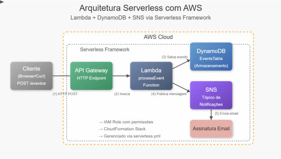

# **Laboratório Serverless Framework com Lambda, DynamoDB e SNS**

## **Objetivo**

Criar um sistema de notificação de eventos utilizando o framework Serverless com AWS Lambda, DynamoDB e SNS, conforme desenho arquitetural abaixo.



## **Pré-requisitos**

* Conta AWS (acadêmica ou sandbox)  
* Node.js instalado (versão 14.x ou superior)  
* NPM instalado  
* AWS CLI configurado com credenciais válidas  
* Editor de código (VS Code recomendado)

---

## **PARTE 1: Configuração Inicial**

### **Passo 1: Instalar o Serverless Framework**

1. Abra o terminal (PowerShell ou Bash). Execute o comando:

    ```bash
    npm install -g serverless
    ```

2. Verifique a instalação:

    ```bash
    serverless --version ou o comando abreviado: sls --version
    ```

### **Passo 2: Criar um Projeto Serverless**

1. No terminal, navegue até sua pasta de projetos. Execute o comando:

    ```bash
    serverless create --template aws-nodejs --path evento-notificacao
    ```

2. Navegue para a pasta criada:

    ```bash
    cd evento-notificacao
    ```

### **Passo 3: Instalar Dependências**

Execute o comando:

```bash
 npm init -y
```

1. Instale as dependências AWS SDK:

```bash
    npm install aws-sdk --save
```

---

## **PARTE 2: Configuração do Arquivo Serverless.yml Passo 1: Configurar o arquivo serverless.yml**

1. Abra o arquivo `serverless.yml` no seu editor de código  
2. Substitua todo o conteúdo pelo seguinte:

    ```yaml
    service: evento-notificacao

    frameworkVersion: '3'

    provider:
      name: aws
      runtime: nodejs18.x
      region: us-east-1
      environment:
        EVENTS_TABLE: ${self:service}-events-table-${sls:stage}
        SNS_TOPIC_ARN: !Ref EventNotificationsTopic
      iam:
        role:
          statements:
            # Permissões para DynamoDB
            - Effect: Allow
              Action:
                - dynamodb:PutItem
                - dynamodb:GetItem
                - dynamodb:Scan
              Resource: !GetAtt EventsTable.Arn
            # Permissões para SNS
            - Effect: Allow
              Action:
                - sns:Publish
              Resource: !Ref EventNotificationsTopic

    functions:
      processEvent:
        handler: handler.processEvent
        events:
          - http:
              path: eventos
              method: post
              cors: true

    resources:
      Resources:
        # Tabela DynamoDB
        EventsTable:
          Type: AWS::DynamoDB::Table
          Properties:
            TableName: ${self:service}-events-table-${sls:stage}
            BillingMode: PAY_PER_REQUEST
            AttributeDefinitions:
              - AttributeName: id
                AttributeType: S
            KeySchema:
              - AttributeName: id
                KeyType: HASH

        # Tópico SNS
        EventNotificationsTopic:
          Type: AWS::SNS::Topic
          Properties:
            TopicName: ${self:service}-notifications-${sls:stage}
            DisplayName: Event Notifications

        # Assinatura de Email para o Tópico SNS
        EmailSubscription:
          Type: AWS::SNS::Subscription
          Properties:
            TopicArn: !Ref EventNotificationsTopic
            Protocol: email
            Endpoint: "SEU_EMAIL@exemplo.com"  # Substitua pelo seu email
    ```

3. Na linha com `Endpoint: "SEU_EMAIL@exemplo.com"`, substitua pelo seu email real

---

## **PARTE 2: Implementação do Código da Função**

### **Passo 1: Editar o arquivo handler.js**

1. Abra o arquivo `handler.js` no seu editor  
2. Substitua todo o conteúdo pelo seguinte código:

```javascript
'use strict';


const AWS = require('aws-sdk');
const dynamoDB = new AWS.DynamoDB.DocumentClient();
const sns = new AWS.SNS();


module.exports.processEvent = async (event) => {
  try {
    // Parsing do corpo da requisição
    const requestBody = JSON.parse(event.body);
   
    // Criação do objeto de evento
    const eventData = {
      id: Date.now().toString(),
      eventName: requestBody.eventName || 'Evento Padrão',
      description: requestBody.description || 'Descrição padrão do evento',
      timestamp: new Date().toISOString()
    };
   
    console.log('Dados do evento a serem salvos:', eventData);
   
    // Parâmetros para salvar no DynamoDB
    const dynamoParams = {
      TableName: process.env.EVENTS_TABLE,
      Item: eventData
    };
   
    // Salvar no DynamoDB
    console.log('Salvando no DynamoDB...');
    await dynamoDB.put(dynamoParams).promise();
    console.log('Dados salvos com sucesso no DynamoDB!');
   
    // Preparar mensagem para SNS
    const message = `Novo evento registrado: ${eventData.eventName}\n` +
                    `Descrição: ${eventData.description}\n` +
                    `Horário: ${eventData.timestamp}`;
   
    // Parâmetros para publicação no SNS
    const snsParams = {
      TopicArn: process.env.SNS_TOPIC_ARN,
      Message: message,
      Subject: 'Notificação de Novo Evento'
    };
   
    // Publicar no SNS
    console.log('Enviando notificação via SNS...');
    await sns.publish(snsParams).promise();
    console.log('Notificação enviada com sucesso!');
   
    // Retorno da função
    return {
      statusCode: 200,
      headers: {
        'Access-Control-Allow-Origin': '*',
        'Content-Type': 'application/json'
      },
      body: JSON.stringify({
        message: 'Evento registrado com sucesso!',
        eventId: eventData.id
      })
    };
  } catch (error) {
    console.error('Erro:', error);
    return {
      statusCode: 500,
      headers: {
        'Access-Control-Allow-Origin': '*',
        'Content-Type': 'application/json'
      },
      body: JSON.stringify({
        message: 'Erro ao processar o evento',
        error: error.message
      })
    };
  }
};
```

---

## **PARTE 3: Implantação e Teste**

### **Passo 1: Implantar o Projeto**

No terminal, na pasta do projeto, execute:  
 serverless deploy

1. Aguarde a implantação ser concluída (pode levar alguns minutos)  
2. Anote o endpoint gerado (URL da API Gateway) que aparecerá no resultado

### **Passo 2: Confirmar a Assinatura do Email**

1. Verifique sua caixa de entrada  
2. Procure por um email da AWS com o título "AWS Notification \- Subscription Confirmation"  
3. Clique no link "Confirm subscription" no email  
4. Você verá uma página confirmando a assinatura

### **Passo 3: Testar a Função**

1. Você pode usar o cURL, Postman ou outra ferramenta para fazer uma requisição POST  
2. Para teste com cURL, abra o terminal e execute:

    ```bash
    curl -X POST \
      https://SEU_ENDPOINT_API_GATEWAY/dev/eventos \
      -H 'Content-Type: application/json' \
      -d '{
        "eventName": "Workshop Serverless Framework",
        "description": "Aula prática sobre Serverless Framework com AWS"
      }'
    ```

3. Substitua `https://SEU_ENDPOINT_API_GATEWAY/dev/eventos` pelo endpoint gerado na implantação

### **Passo 4: Verificar os Resultados**

1. Verifique a resposta da API (deve retornar um status 200 com mensagem de sucesso)  
2. Verifique seu email para confirmar o recebimento da notificação  
3. No Console AWS, navegue até o DynamoDB e verifique a tabela criada:  
   * Nome da tabela: `evento-notificacao-events-table-dev`  
   * Verifique se o item foi inserido corretamente

---

## **Explicação da Abordagem Serverless**

### **Vantagens do Serverless Framework**

1. **Infraestrutura como Código (IaC)**: Todo o ambiente está definido no arquivo `serverless.yml`  
2. **Implantação simplificada**: Um único comando implanta todos os recursos  
3. **Gerenciamento automático de permissões**: O IAM role é configurado automaticamente  
4. **Sem gerenciamento de servidores**: Você foca apenas no código da função

### **Diferenças da Abordagem Manual**

1. O framework cria automaticamente:  
   * API Gateway para expor sua função  
   * Todos os recursos definidos (DynamoDB, SNS)  
   * Permissões IAM necessárias  
2. Utiliza CloudFormation para gerenciar a infraestrutura  
3. Facilita implantações em diferentes ambientes (dev, staging, prod)

---

## **Desafio Extra**

### **Adicionar uma Nova Função**

1. Crie uma nova função no `serverless.yml` para listar eventos  
2. Implemente o código no `handler.js`  
3. Implante novamente e teste a nova funcionalidade

### **Arquitetura Avançada**

1. Adicione validação dos dados de entrada usando middleware  
2. Implemente paginação para a listagem de eventos  
3. Configure diferentes tipos de notificação (email, SMS)

---

## **Solução de Problemas**

1. **Erro de permissão**: Verifique se o usuário AWS tem permissões suficientes  
2. **Falha na implantação**: Verifique a sintaxe do arquivo YAML (indentação é importante)  
3. **Email não recebido**: Confirme se a assinatura foi confirmada  
4. **Erro na função**: Verifique os logs no CloudWatch  
5. **Erro 403/401**: Verifique as configurações de CORS e IAM

---

## **Limpeza de Recursos**

Ao final do laboratório, remova todos os recursos para evitar cobranças:

| serverless remove |
| :---- |

Este comando remove todos os recursos criados pelo Serverless Framework.

---

*Observação: Este laboratório utiliza serviços que podem gerar pequenos custos na AWS. Certifique-se de remover todos os recursos após a conclusão.*
